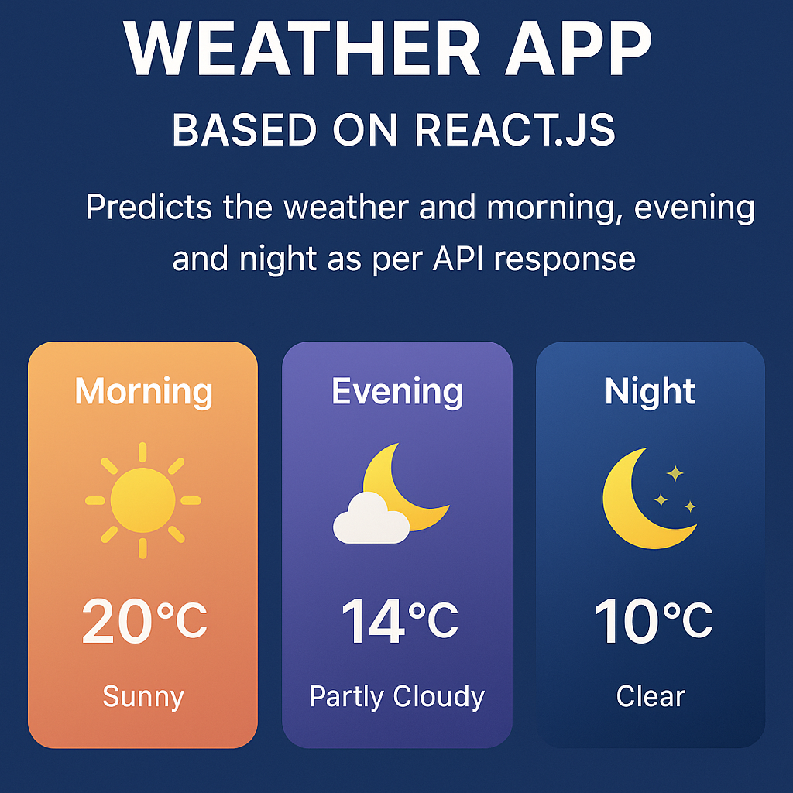

# ⛅ Weather Inspect 🌦️

Welcome to **Weather Inspect**, a dynamic React.js application that determines your local weather by accessing your **current geolocation** and displaying a tailored UI experience such as 🌤️ Morning, 🌙 Night, ☁️ Cloudy, or 🌧️ Rainy — all powered by weather API data!



---

## 📌 Features

- 📍 Get **current location** using browser geolocation
- 🔄 Fetch **real-time weather data** based on coordinates
- 🧠 Smart UI display based on:
  - 🌅 Morning
  - 🌇 Evening
  - 🌙 Night
  - ☁️ Cloudy
  - 🌧️ Rainy
- ⚡ Fast and responsive React components
- 🎨 Images dynamically displayed from `images/` folder

---

## 📸 Screenshots

| Morning | Night | Cloudy | Rainy |
|--------|-------|--------|-------|
|  |  |  |  |

---

## 🚀 How to Run Locally

```bash
git clone https://github.com/your-username/weather-inspect.git
cd weather-inspect
npm install
npm start
