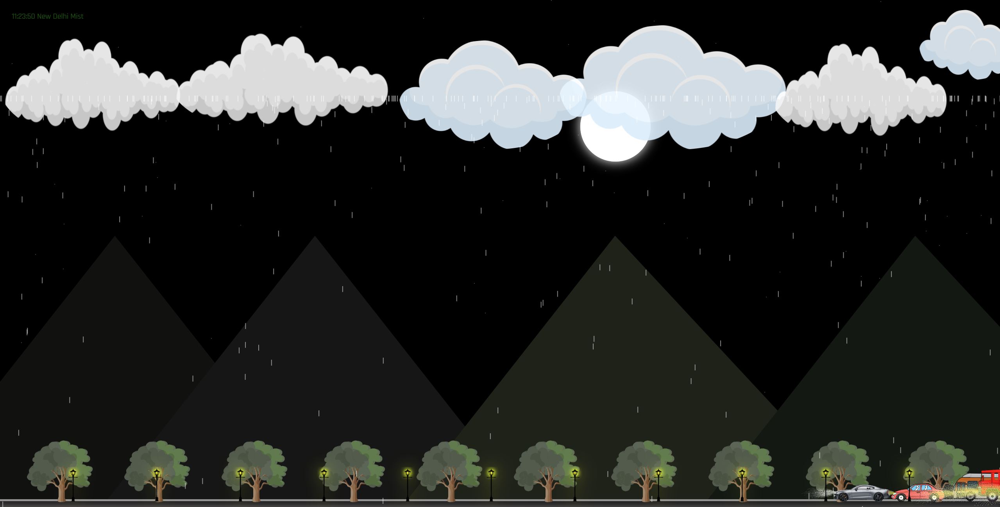

# ⛅ Weather Inspect 🌦️

Welcome to **Weather Inspect**, a dynamic React.js application that determines your local weather by accessing your **current geolocation** and displaying a tailored UI experience such as 🌤️ Morning, 🌙 Night, ☁️ Cloudy, or 🌧️ Rainy — all powered by weather API data!


---

## 📌 Features

- 📍 Get **current location** using browser geolocation
- 🔄 Fetch **real-time weather data** based on coordinates
- 🧠 Smart UI display based on:
  - 🌅 Morning
  - 🌇 Evening
  - 🌙 Night
  - ☁️ Cloudy
  - 🌧️ Rainy
- ⚡ Fast and responsive React components
- 🎨 Images dynamically displayed from `images/` folder

---

🧰 Built With
⚛️ React.js
🌐 OpenWeatherMap API (or your chosen API)
💅 CSS3 / Tailwind / Styled Components (your choice)
📂 Geolocation API

---


🔐 Permissions Required
📍 Location access is required to personalize your weather experience


---

📁 Folder Structure
weather-inspect/
├── public/
├── src/
│   ├── components/
│   ├── images/         # 🌄 Weather state images
│   ├── App.js
│   └── ...
└── README.md

---

## 📸 Screenshots

### 🌞 **Morning**


### 🌇 **Evening**


### 🌧️ **Rainy**



## 🚀 How to Run Locally

```bash
git clone https://github.com/your-username/weather-inspect.git
cd weather-inspect
npm install
npm start
